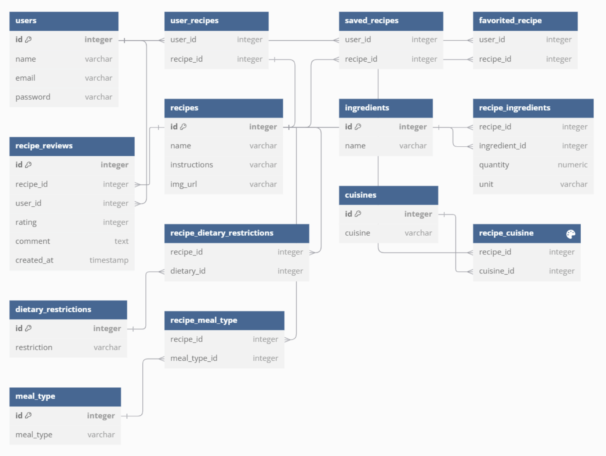

# Entity Relationship Diagram

Reference the Creating an Entity Relationship Diagram final project guide in the course portal for more information about how to complete this deliverable.

## List of Tables

Base Tables:
- `users`
- `recipes`
- `ingredients`
- `dietary_restrictions`
- `cuisines`
- `meal_type`

Junction Tables:
- `user_recipes`
- `saved_recipes`
- `favorited_recipe`
- `recipe_dietary_restrictions`
- `recipe_cuisine`
- `recipe_meal_type`

Linking Tables with additional attributes:
- `recipe_reviews`
- `recipe_ingredients`

## Entity Relationship Diagram

For more details about the tables (with schema definition and comments), refer to original diagram on dbdiagram.io: https://dbdiagram.io/d/PlatePal-Entity-Relation-Diagram-Final-6720730cb4216d5a288bc9c1
